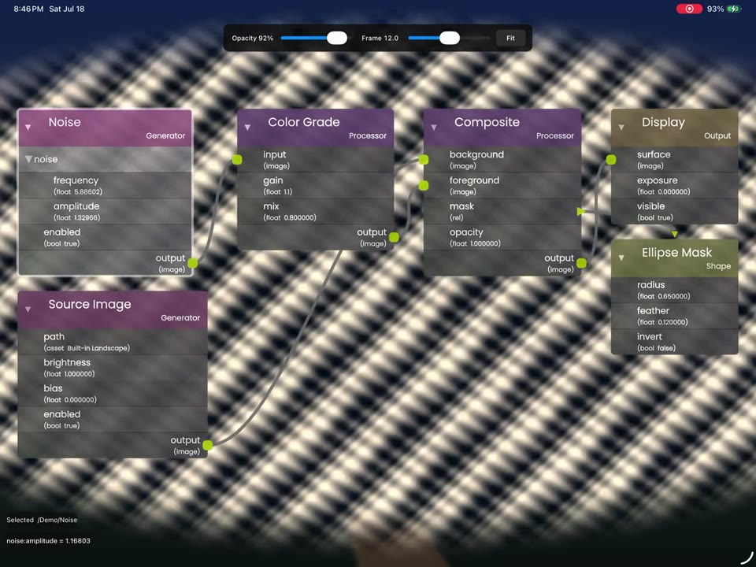

# NoodlesDemo

NoodlesDemo is a reusable C++17/Objective-C++ host for interactive
[`noodles`](https://github.com/facebookexperimental/noodles) node graphs on
iPadOS and macOS. It supplies the application-facing pieces that the renderer
deliberately does not own: an editable document seam, interaction controller,
Apple GL views, resource plumbing, and runnable example applications.

The core is host-agnostic and depends only on `noodles::noodles`. OpenUSD is an
optional adapter, not part of the core API. The Inkwell iPad application uses
that adapter while the public demos use an in-memory demo graph, so both
exercise the same layout, rendering, hit-testing, value editing, connection,
folding, minimap, and gesture implementation.

## Targets

| CMake target | Purpose |
| --- | --- |
| `NoodlesDemo::Core` | Graph DTO/document API plus the shared editor/controller |
| `NoodlesDemo::USD` | Optional source-embedded OpenUSD collector and mutation adapter |
| `NoodlesDemo::UIKit` | `CAEAGLLayer`/OpenGL ES 3 iPadOS view |
| `NoodlesDemo::AppKit` | `NSOpenGLView` macOS view |

The UIKit and AppKit views render the same `GraphEditor`. Platform code only
creates the GL context, translates native events, schedules frames, and can
optionally forward stylus misses to a background canvas. Without such a target,
Pencil behaves like touch across the graph surface.

`NoodlesDemoHair` is an example target, not part of the installed package: the
hair grooming systems are a consumer of Core, deliberately kept outside it so
the package stays hair-agnostic.

## Runnable demo surface

The runnable macOS and iPadOS products are both named NoodlesDemo. They open on
**Hair Groom**, a node-driven 3D hair grooming tool, and a switcher in the
control bar selects it or one of four image-processing documents.

### Hair Groom

A procedural scalp, a seeded guide set, editable gizmos, and an XGen-style
clump, rendered into the graph view's *own* OpenGL drawable with the transparent
graph composited on top of them — the groom the graph evaluates to, not a
picture of one beside it. Evaluation runs from `/Hair/Output` through the
connections you actually authored, so rewiring the graph rewires the groom. Five
node-owned tools — Draw Guides, Edit Points, Comb Brush, Edit Clump, Paint
Clump — are armed by `tool:*` switches on the nodes that own them, and exactly
one may be active.

See [HAIR_DEMO.md](HAIR_DEMO.md) for the architecture, the full control
reference, and the manual test sequence.

### Image processing

Four example documents, each rendered by the same shared image processor:

- **Grain Comp** — the six-node contract graph shown below: film grain graded
  and merged over the plate through an ellipse matte, with an animated grade;
- **CRT TV** — chromatic fringing, broadcast static, sync jitter, scanlines,
  and a tube vignette, with static and fringing animated over the frame range;
- **Kaleidoscope** — mirrored wedges, swirl, posterize, and tint, with the
  fold rotation and swirl twist animated;
- **Stress Test** — 100+ nodes placed by the editor's layered auto-layout:
  eight chains of real image ops merging through a mix tree, so every node
  executes per pixel and editing/navigation/throughput are probed at scale.

Each graph keeps its edits while the app runs; switching back restores them.
The image documents default to Grain Comp. The Add Node control offers a palette
of executable op types — Grade, Invert, Pixelate, Wave, Mix, Noise, Blur,
Threshold, Tint, Chroma, Scanlines, Vignette, Kaleido, Swirl, Posterize, and
Halftone — placed by the editor's incremental auto-layout; each has a real exec
function in the shared image processor, so a new node changes the render as soon
as it is wired between an image source and Display.

Grain Comp's six-node, topology-driven pipeline:

[](media/demo.mp4)

[Watch the 39-second NoodlesDemo video](media/demo.mp4).

```text
Film Grain.output:image    -> Grain Grade.input:image
Source Image.output:image  -> Grain Merge.background:image
Grain Grade.output:image   -> Grain Merge.foreground:image
Grain Merge.mask:relationship -> Grain Matte
Grain Merge.output:image   -> Display.surface:image
```

(Those are the display names; the node ids are `/Demo/Noise`, `/Demo/Grade`,
`/Demo/Composite`, `/Demo/Mask`, `/Demo/SourceImage` and `/Demo/Display`.)

A shared C++ example processor evaluates the current graph snapshot from the
Display input, so live value edits, Boolean toggles, connection edits, and frame
interpolation visibly change the output rather than changing the graph UI alone.
The Source Image node exposes an `asset`-typed `path` row: tapping its middle
opens the native image browser, decodes the selected file off the main thread,
and replaces the built-in landscape input. The apps also expose the shipping
overlay defaults — opacity from 0.15 through 1.0 (initially 0.5) and
display-frame scrubbing from frame 0 through 24, including an interpolated
animated value.

The graph itself demonstrates selection, movement, whole-node and property-group
folding, scalar scrubbing, Boolean toggles, connection authoring and editing,
minimap navigation, and fit-to-view layout. The iPad demo treats Pencil and
touch alike for graph editing; the macOS app exercises mouse, scroll-pan, and
trackpad magnification.

## Supported and tested behavior

`tests/` is the behavior contract: `noodles_demo_core`,
`noodles_demo_contract`, `noodles_demo_hair`, plus `noodles_demo_render`,
`noodles_demo_hair_render` and `noodles_demo_appkit_shell_smoke` on a macOS
host, and `noodles_demo_usd_document` when the USD adapter is enabled. The
runnable apps remain the platform-interaction smoke test.

## Quick start

Install a current iOS-capable Noodles package, then build the macOS demo:

```sh
cmake -S . -B build -DCMAKE_BUILD_TYPE=Release \
  -DCMAKE_PREFIX_PATH=/path/to/noodles/install
cmake --build build --parallel
ctest --test-dir build --output-on-failure
```

For local source development, pass
`-DNOODLES_DEMO_NOODLES_SOURCE_DIR=/path/to/noodles`. Installed consumers use
`find_package(NoodlesDemo CONFIG REQUIRED)` and link the namespaced targets.

See [BUILDING.md](BUILDING.md) for iPadOS, install, and external-consumer
commands. Maintainers should follow the coordinated dependency sequence in
[RELEASING.md](RELEASING.md).

## Distribution

NoodlesDemo is MIT licensed. Noodles is a separate MIT-licensed dependency;
its font and third-party notices ship with the Noodles package. A source
distribution must include this repository's `LICENSE` and declare a compatible
Noodles package dependency. No Inkwell product assets or private fixtures are
part of this package.
